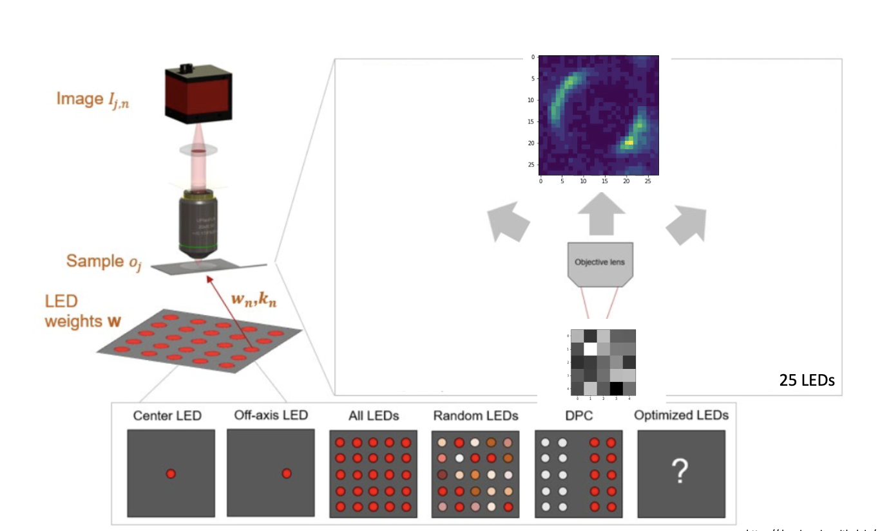
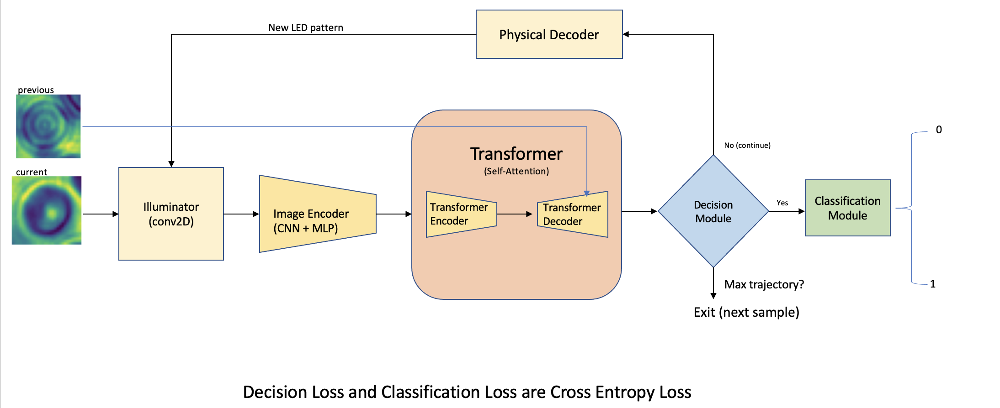
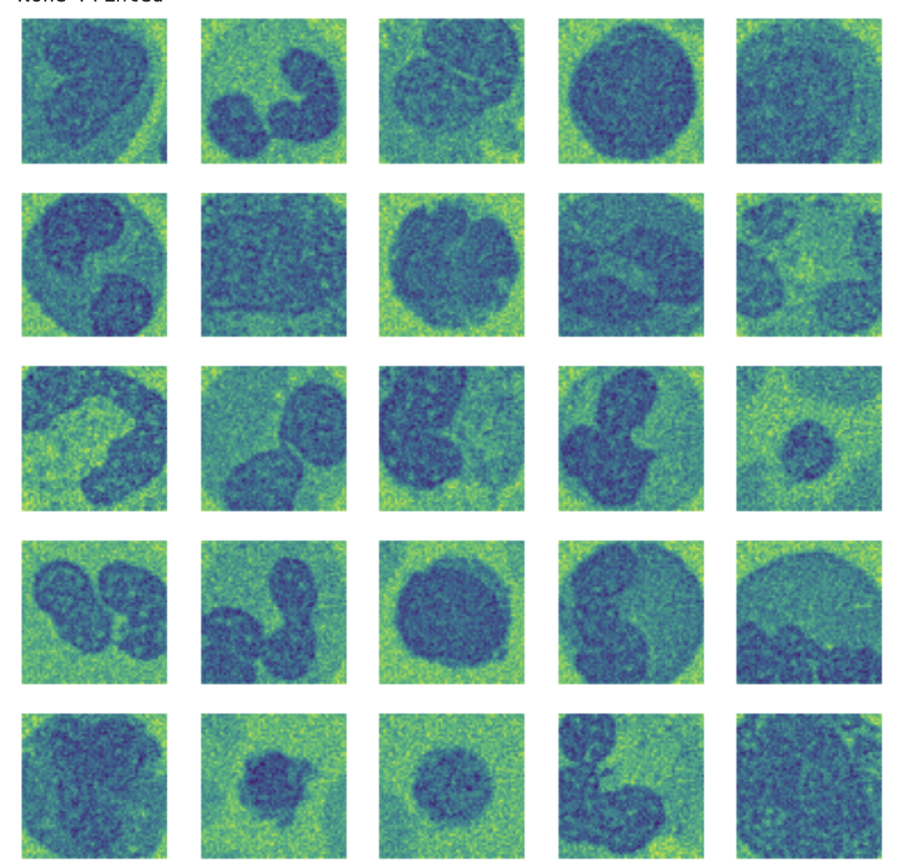
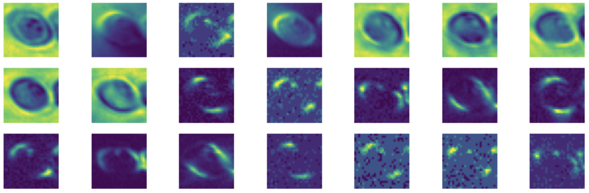

# transformed-illumination

## Overall Idea

## Model Pipeline

## Results

### With common LED Illumination for all the specimens

### With Adaptive LED Illumination for each the specimen with different trajcetory length

<a href="./resources/adaptive_illumination_bathla_ravi.pdf">Paper</a>

